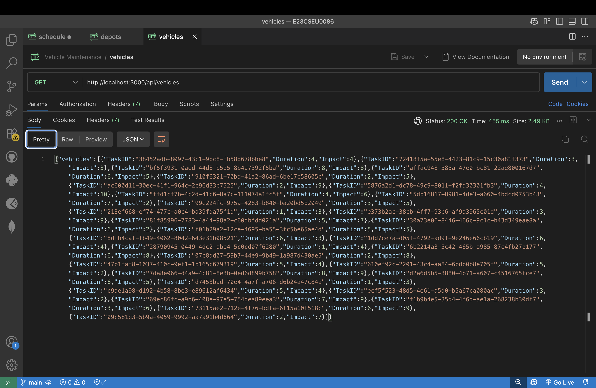
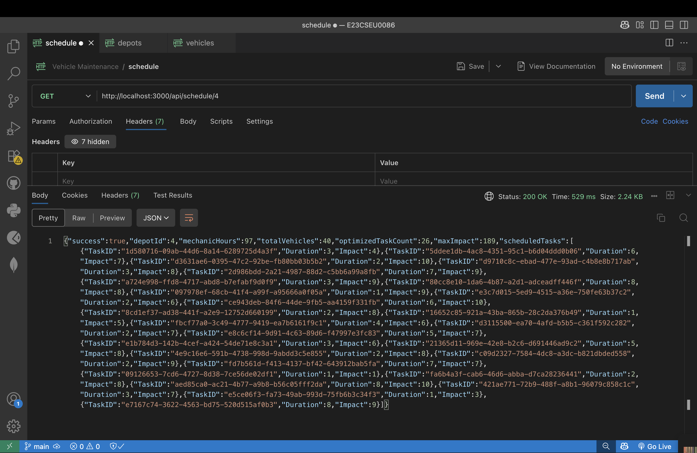
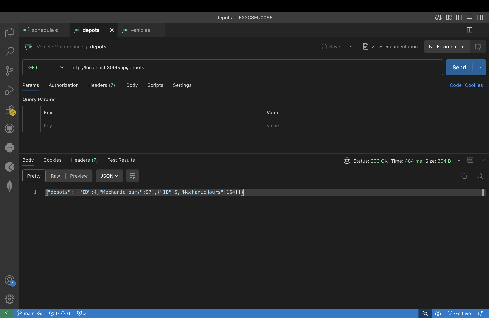

# Vehicle Maintenance Scheduler

A backend-based vehicle maintenance scheduling system built using Node.js and Express.js. The project focuses on optimizing vehicle servicing tasks across depots by intelligently allocating available mechanic hours using the 0/1 Knapsack Algorithm.

The system helps determine which maintenance tasks should be prioritized to maximize operational impact while staying within resource constraints.

## Tech Stack

- Node.js
- Express.js
- Axios

## Project Structure

The project is organized in a clean and scalable structure:

- controllers → handles request and response logic
- routes → defines API endpoints
- services → contains business logic and scheduling operations
- algorithms → includes the optimization logic using the knapsack algorithm

## API Endpoints

### GET /api/depots

Fetches the list of all available depots.

### GET /api/vehicles

Returns all vehicle maintenance tasks and related details.

### GET /api/schedule/:depotId

Generates an optimized maintenance schedule for a specific depot using the 0/1 Knapsack Algorithm.

## Optimization Logic

The scheduling system uses the 0/1 Knapsack Algorithm to optimize maintenance planning.

Objective:
maximize total maintenance impact while staying within the available mechanic working hours.

The algorithm selects the most valuable set of maintenance tasks without exceeding the total time capacity.

## Screenshots

  

## How to Run

```bash
npm install
npm run dev